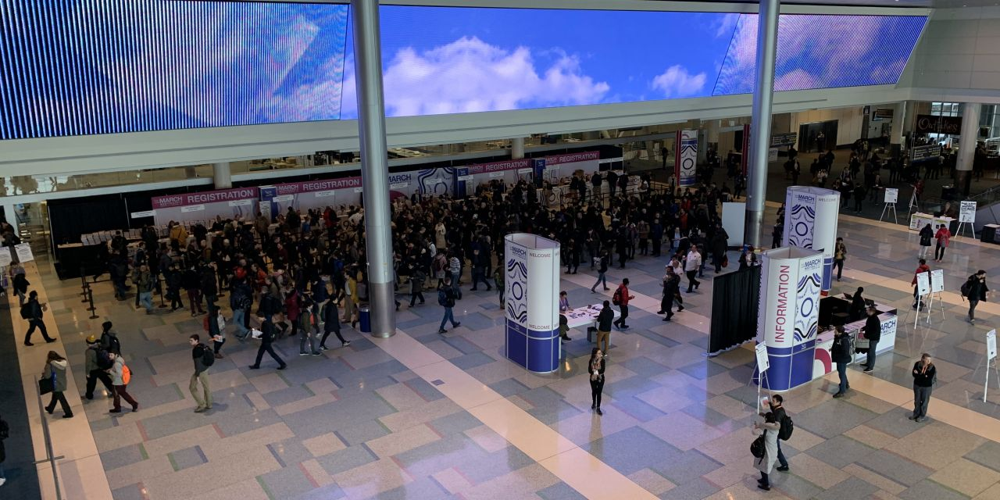
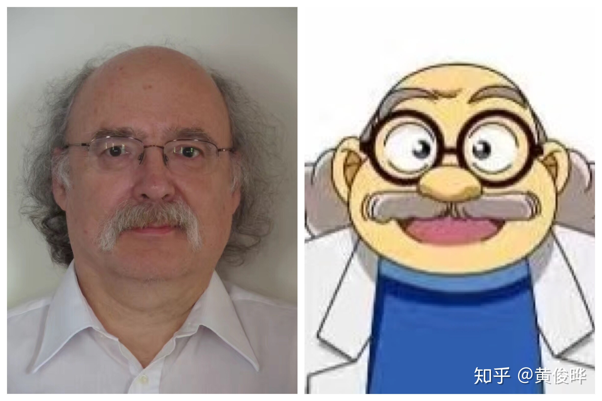
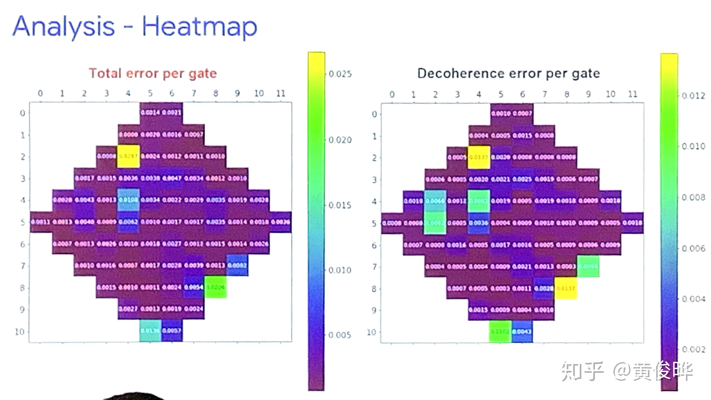
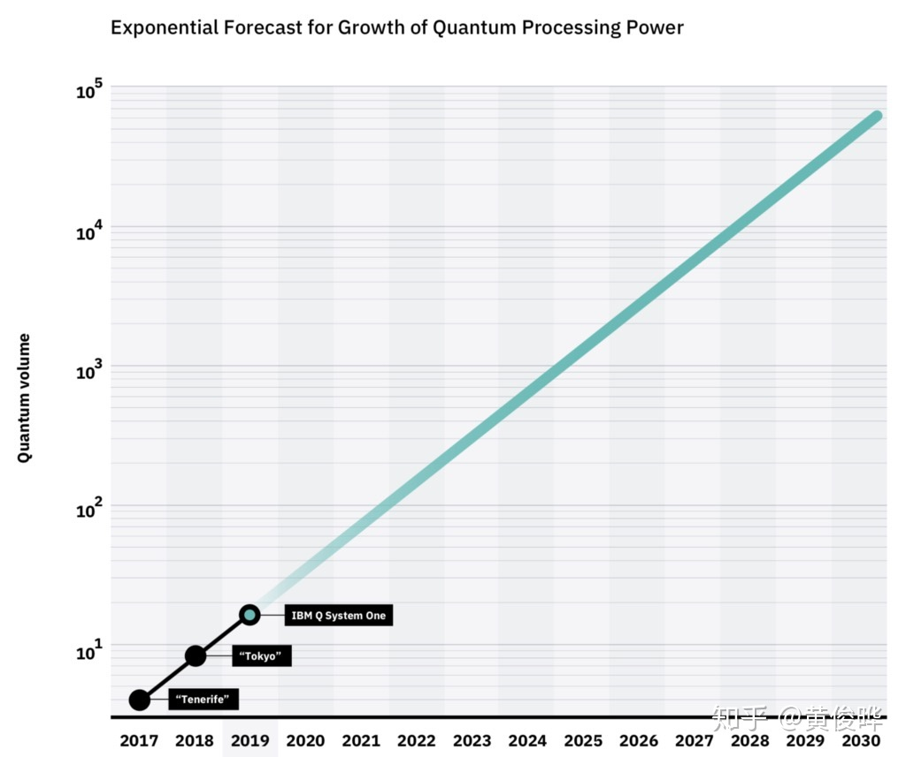
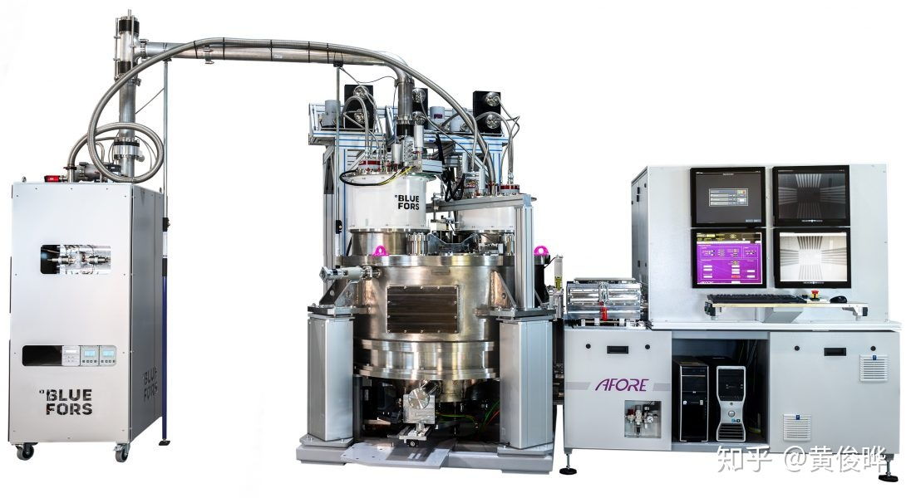
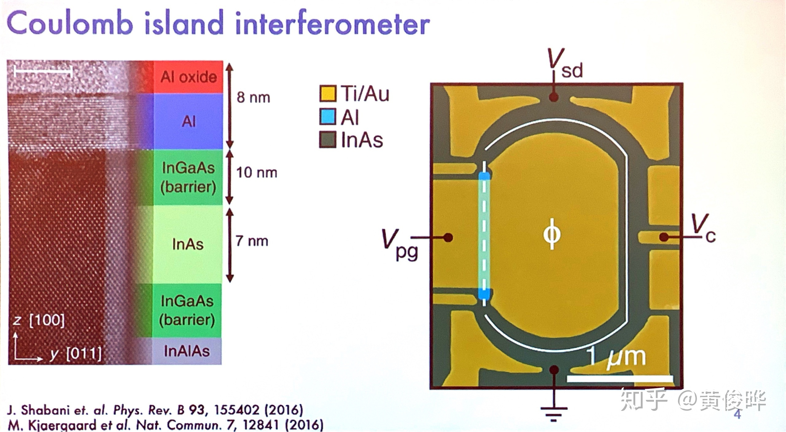
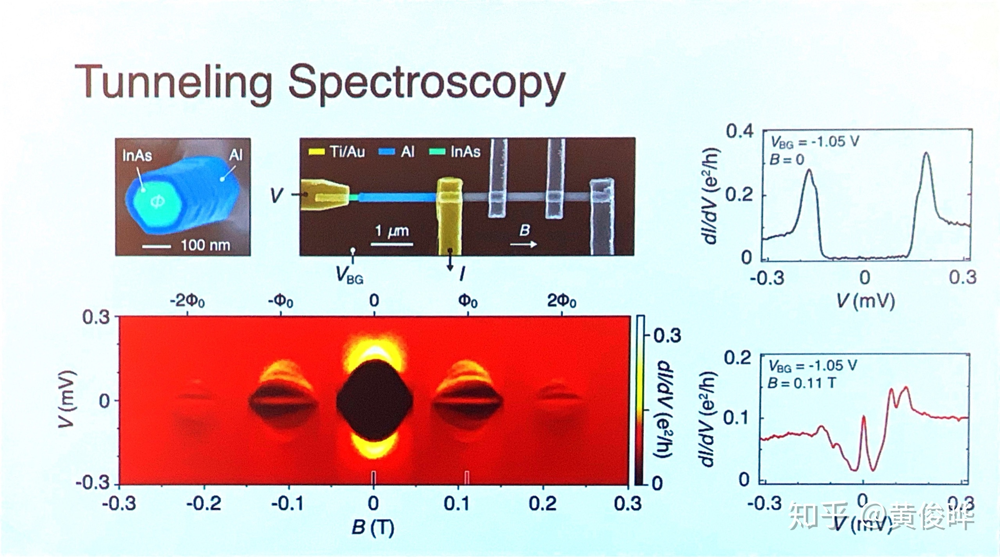
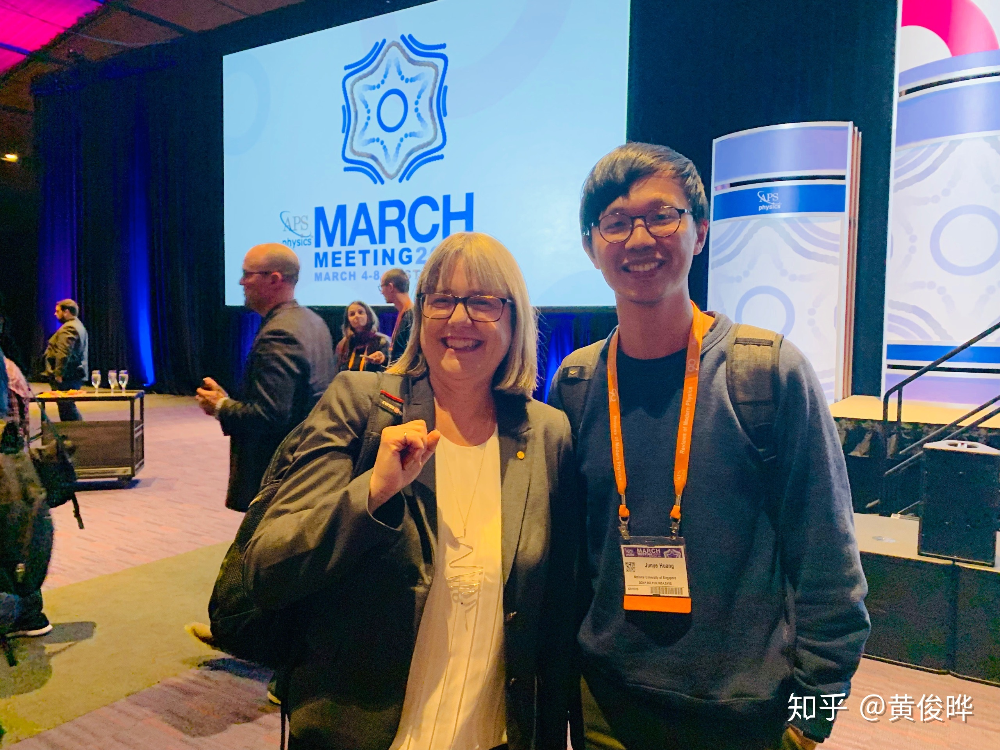

*会场人来人往*

刚参加完March Meeting回来，赶紧把所见所想写下来，不然再过几天就没有动力写了。写出来的流水账还请大家见谅。

这是我第一次参加March Meeting。今年的会议在波士顿举行。虽然事前知道这是物理学界最大的会议，但是那种庞大的震撼感只有参会才能体会到。会议一共五天，从早上8点开到下午5点半。一天三个session，每个session都有70个左右报告同时进行。普通报告12分钟，邀请报告36分钟，一天下来就有2000个报告。每个session之间只有15分钟休息时间，而从会场一头走到另一头就要10分钟。如果一直都有感兴趣的报告，那就连吃午饭的时间都没有。

今年的会议一共有11000人参加，我感觉似乎所有物理学家都在。在会上我见到了很多在论文上看到的大牛：Philip Kim, Allan MacDonald, Ashvin Vishwanath, Kin Fai Mak, Andrea Young, John Preskill, Jason Alicea等等。还见到一些邮件交流过但还没见过面的人：Joel I-Jan Wang和Yu Saito。有天上厕所时猛然发现站在我旁边的就是鼎鼎大名的阿笠博士：好蛋爷。好蛋爷爷人很低调，拿了诺贝尔奖还来做普通报告，10分钟报告，2分钟问问题，跟博士生一样。March Meeting对于很多人来说还是同学聚会。我实验室的同学们都能在March Meeting见到很多国内本科同学。然而像我在大NTU毕业的，是不可能遇到同学的。

*好蛋爷爷与阿笠博士*

March Meeting跟我以前参加过的会议不一样的地方不止是规模，还有各种活动的自发性和多样性。70个平行session，你可以任意组合。像我这样搞二维材料的学生，听得最多的却是量子计算机报告。还去听了一个气候变化的报告和几个讲无人驾驶和飞机的报告。你也可以选择不听报告，找人讨论。整个会场里，无时无刻不能看到很多人在讨论。真是一千个人就有一千个不同的March Meeting，每个人的参会体验都不一样。

## Twistronics

今年最火的报告是去年曹原开的twistronics坑。现在发现，除了两张单层石墨烯扯一下可以超导，两张双层石墨烯、ABC三层石墨烯+氮化硼、硒化钨WSe2扯一扯也能超导。曹原这么一扯，就给二维材料续命至少5年。二维材料从石墨烯开始，搞了几年以后，发现其他二维材料MoS2和各种TMD、黑磷，续命好几年。单种材料搞得差不多以后发现可以把一种材料放到另一种材料上，排列组合层出不穷，又续命好几年。去年这么一扯，又增加了一个自由度。可以想象在不久将来，我们会看到五六层材料扯出不同角度，实现各种神奇现象。

目前来说，这些实验难度非常高，搞实验的组屈指可数，只有动手能力最强的几个组有这个能力：Pablo Jarillo-Herrero, Philip Kim, Andrea Young, Cory Dean, Feng Wang等等。搞理论的人倒是非常多。之前搞拓扑材料起家的人似乎都来高twisted系统了：傅亮、Ashvin Vishwanath, Andrei Bernevig等等。当然也有一些老牌的大牛：Allen MacDonald, Sanker Das Sarma, Francisco Guinea等等。今年早些时候在UCSB的[KITP开了twisted的会议](http://online.kitp.ucsb.edu/online/bands_m19/)，而且都有录像，所以March Meeting我没有怎么听twisted的talk。大部分时间我都去听量子计算机的报告。

## 量子计算机

### 谷歌

*Bristlecone的错误率分布*

谷歌的72量子比特Bristlecone量子处理器进展缓慢。[去年March Meeting放的卫星](https://ai.googleblog.com/2018/03/a-preview-of-bristlecone-googles-new.html)到现在都还没完成调试。今年的报告讲的主要是怎么系统性地做优化调试。Julian Kelly一月时来新加坡讲的就是这些，没有什么新的信息。谷歌愿意放长线钓大鱼，为以后更大的量子计算机慢慢打好基础的做法应该鼓励，只是公关部门提早放卫星导致现在大家心里落差很大。量子霸权估计还要好几年才能实现。

### IBM

*量子摩尔定律*

很明显IBM被去年谷歌放卫星惹得坐不住，今年也来放卫星。首先今年早些时候发布槽点满满的全球第一台商用通用量子计算机[System One](https://newsroom.ibm.com/2019-01-08-IBM-Unveils-Worlds-First-Integrated-Quantum-Computing-System-for-Commercial-Use)。这量子计算机性能比手机还弱，价值上千万，唯一的亮点是好看。然后March Meeting期间在IBM博客上[发表文章](https://www.ibm.com/blogs/research/2019/03/power-quantum-device/)，宣称System One的量子体积（Quantum Volume，IBM提出的一个衡量量子计算机算力的标准）达到新高度。过去几年IBM的量子处理器的量子体积进步速符合摩尔定律，并由此提出“量子摩尔定律”。三个数据点就推出规律胆子真大。不过当年摩尔也是四个数据点就提出这个大胆的猜想。当然摩尔定律是一个人为的定律，一开始是猜想，后来变成了指导行业发展的方向标。摩尔定律神奇的地方不在于其准确性，而在于半导体行业能够长时间持续实现这个目标。IBM放的另一个卫星是500微秒的退相干时间，大概是之前的5倍。报告里只放了一个图，没有解释怎么能达到如此长的退相干时间。

### Rigetti

Rigetti的报告刚好都和其他我感兴趣的报告冲突了，没有去听。但听说今年很风光，全方面提高了量子比特的退相干时间，[达到100微秒级别](https://arxiv.org/abs/1901.08042)，两量子比特门的保真度达到99%。Rigetti去年放卫星说要造128量子比特的量子处理器，真是水平越低吹的牛越大。不过作为初创公司能跟谷歌、IBM这样的大公司对着干，实在不得不佩服。

### 英特尔

*低温高速自动测量系统*

英特尔在今年的March Meeting展示了它的工业实力。它认为量子计算机的两大瓶颈在于：实验反馈回路太慢和量子比特的接线太多。英特尔认为没有必要在乎100个量子比特的问题，只在乎100万个量子比特的问题。当然这是因为它远远落后于谷歌和IBM，不得不另辟曲径。在英特尔眼里，量子比特就是晶体管（英特尔主打硅自旋量子比特）。他们打算用造晶体管的那套方法来造量子比特。一方面建立常温测量和低温测量的相关性，通过常温测量高速大量筛选优良器件进行低温测量，从而大大提高开发的速度。另一方面，它和Bluefors、Afore合作[开发低温高速自动测量系统](https://newsroom.intel.com/news/intel-drives-development-quantum-cryoprober-bluefors-afore-accelerate-quantum-computing/#gs.0k0x47)，提高低温测量的速度。接线方面，他们在门电路、芯片、整个系统三个层次进行优化，减少接线。

### 微软

在这几家公司里，微软的进度是最慢的。微软跟谷歌类似，没有太多搞硬件的传统，只能靠收买大学实验室起家。现在微软投资的实验室差不多有十家，遍布全球。微软投入的资金非常大，应该比谷歌多很多，跟IBM差不多。微软的策略比较特别，它想做拓扑量子比特。拓扑量子比特在理论上可以实现非常长的退相干时间，非常高的量子门保真度。一个拓扑量子比特可以顶一千个普通超导量子比特，从而实现弯道超车。然而拓扑量子比特的基础，神奇的马约拉纳零能模仍然未能被严格证实，量子比特的实现遥遥无期。可以说其他家都开始解决工程问题，而微软仍未解决最基础的科学问题。

*Flux induced Majorana zero modes*

从今年的报告看来，Kouwenhoven和Marcus组都在力图证明纳米线两端的零能模具有非局域的相关性，以此用来证明这些零能模是马约拉纳零能模。这些实现以后，下一步应该就是诺奖级别的实验——braiding。实现能零能模的braiding，而且能展示出非阿贝性统计，充分证明零能模是马约拉纳零能模。在那以后才能开始尝试做拓扑量子比特。这么看来五年内很难看到第一个拓扑量子比特。希望微软能沉住气，不要被其他几家公司放卫星的影响。

## 签证问题

今年有很多人去不了March Meeting。有些人在美国读书工作，回国办续签被卡了好几个月，现在仍在国内等签证。这些人包括曹原。曹原在会议第一天第一场有个邀请报告，结果去不了，只能让实验室的同事做报告。还有很多在国内工作的中国人拿不到B1/2签证去开会，或者很迟才拿到不能全程参加会议。APS已经注意到这个问题，正在搜集数据和典型案例，计划跟国会干涉。

最后放一张我最新抓到的一只诺贝尔奖得主^_^

*Donna Strickland*
