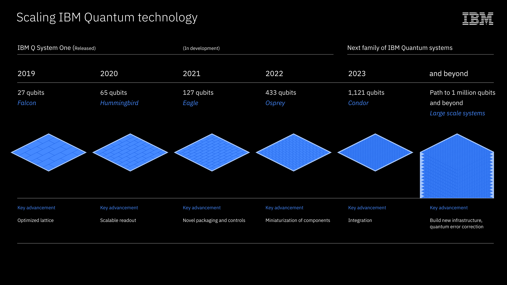
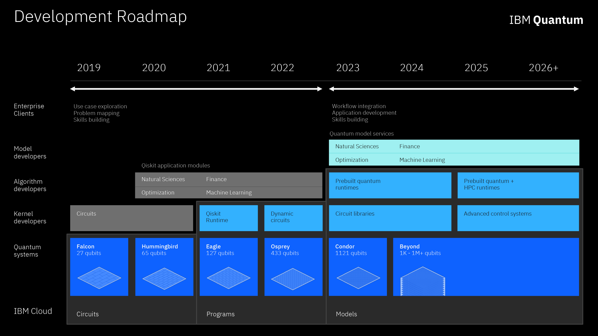
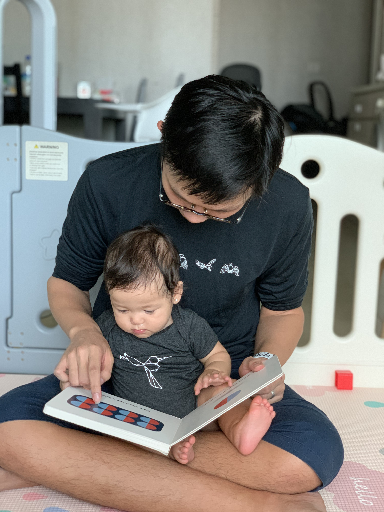
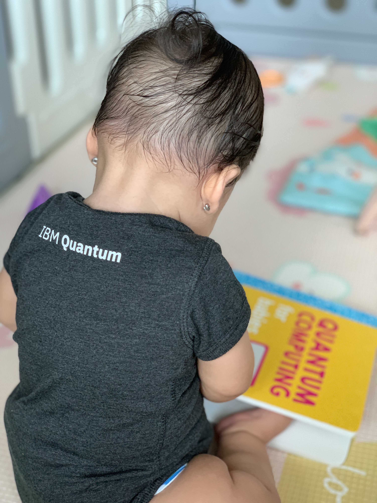

Today is my first work anniversary at IBM Quantum. I figure it’s a good occasion to pause for a moment and reflect what I have done and learned in the past one year.

## Highlights

I mind you that this blog post is very lengthy. So I want to start off with some highlights of the things I have done (in no particular order).



- **[Got a like from the legendary Peter Shor!](https://twitter.com/HuangJunye/status/1310765609769029632?s=20)** for making a browser playable version of QPong. Definitely one of the biggest moment of my career.
- **Received [Outstanding Accomplishment recognition from IBM Research (IBM internal link)](https://w3.ibm.com/w3publisher/ibm-research/recognition/ibm-research-accomplishments/outstanding-research-accomplishments)** together with the team behind Qiskit Global Summer School and Qiskit textbook. I don’t feel I deserve this award. Outstanding research achievement award is highest level of recognition in IBM Research and my contributions to Qiskit Global Summer School and Qiskit textbook are quite insignificant. All the credits go to great teamwork!
- **[Went on a podcast.](https://podcasts.google.com/feed/aHR0cHM6Ly9hbmNob3IuZm0vcy9jNzYxYTA0L3BvZGNhc3QvcnNz/episode/ODkxMTY1ZmEtZDgzMy00OWY1LTk0NDQtMmRlNjVkYjM3NWFj?sa=X&ved=0CAUQkfYCahcKEwio_vrSy47vAhUAAAAAHQAAAAAQAQ)** Talked about Qiskit community and even a little bit about topological quantum computing and Majorana with host Ethan on Quantum Computing Now podcast. This podcast has an [impressive list of guests](https://podcasts.google.com/feed/aHR0cHM6Ly9hbmNob3IuZm0vcy9jNzYxYTA0L3BvZGNhc3QvcnNz?sa=X&ved=0CAMQ4aUDahcKEwio_vrSy47vAhUAAAAAHQAAAAAQAg). Again I have imposter syndrome feeling that I shouldn’t be there.
- **Wrote a book chapter** on how businesses should decide when, where and how to adopt quantum computing technology, with a few collaborators in Singapore and Europe. Certainly, this won’t be the next Mike & Ike. But I feel proud of getting “writing a book (chapter)” off my bucket list of things to do in life :) The book will be published in the coming months.
- **[Published the first paper from my PhD](https://twitter.com/HuangJunye/status/1313116337166712832?s=20)**: Heteromoiré Engineering on Magnetic Bloch Transport in Twisted Graphene Superlattices.
- **Wrote my PhD thesis** during the pandemic with a full time job and a baby!

## What have I learned?

Here are a few things I learned from last year:
- Working in a great team is awesome!
- I learned a lot more about QC than in grad school.
- I built a lot of meaningful connections inside and outside IBM.

### Working in a great team is awesome!

If you don't already know, the IBM Quantum Community Team is the most awesome team on earth.

#### Openness and Diversity

We are a team of people with similar passions for lowering the barrier of entry to the quantum industry and driving gender, racial and disciplinary diversity in the field. You must be familiar with many of my teammates if you are on #QuantumTwitter: [Abe](https://twitter.com/abe_asfaw), [Olivia](https://twitter.com/Liv_Lanes), [Yuri](https://twitter.com/YuriKobaya), [Hwajung](https://twitter.com/hwajung_kang), [Kayla](https://twitter.com/k_lovin_), [Ryan](https://twitter.com/RyanFMandelbaum), [James](https://twitter.com/decodoku) and [Jim](https://twitter.com/JavaFXpert).

Our team have big dreams and make them happen. We made [an open source textbook](https://qiskit.org/textbook/preface.html) with interactive features for anyone to learn QC. We hosted a [quantum challenge](https://www.ibm.com/blogs/research/2020/05/quantum-challenge-results/) with more than 1700 participants from 45 countries to celebrate the 4th anniversary of having a quantum computer on the cloud (IBM Quantum Experience platform).

We hosted [the biggest QC summer school](https://medium.com/qiskit/quantum-enthusiasts-around-the-world-recount-the-lasting-impact-of-the-qiskit-global-summer-school-1e853530fdcb) with [more than 4000 students](https://medium.com/qiskit/heres-how-i-taught-a-quantum-computing-course-to-over-4-000-students-at-once-d2501843e9a6) last summer and later [released the content as a free online course](https://medium.com/qiskit/were-releasing-a-free-hands-on-introduction-to-quantum-computing-course-online-5db213cea79). And yet just a few months later we broke record again by launching Qubit x Qubit [a partnership with The Coding School](https://medium.com/qiskit/why-we-want-5-000-students-to-take-this-eight-month-intensive-online-quantum-computing-class-5da40e49f26a) to bring quantum education to students with larger number and more diversity. Just last week Qubit x Qubit organized the first [Diversity in Quantum Computing Conference](https://www.qubitbyqubit.org/conference) featuring panel discussions on gender inclusivity and racial equity. And we created [IBM-HBCU center](https://www.ibm.com/blogs/research/2020/09/ibm-hbcu-quantum-center/) to increase collaborations with historically Black collages and universities (HBCUs) which has a total of [23 members](https://www.ibm.com/blogs/research/2021/02/ibm-hbcu-quantum-center-expands/).

We have the [Qiskit advocate program](https://qiskit.org/advocates/) with 200+ advocates from 30+ countries who are  actively contributing to the Qiskit community. We recently launched a [mentorship program](https://github.com/qiskit-community/qiskit-advocate-mentorship-program) to provide advocates more in-depth training opportunities and mentorship by quantum experts.  I personally benefited immensely from IBM mentors [Jim](https://twitter.com/JavaFXpert) and [Greg](https://twitter.com/boland) while working on QPong before joining IBM. I believe this program will allow more people to get into the quantum industry.

#### Clear vision for the quantum future

Apart from the community team, I also feel really fortunate and proud to be part of the wider IBM Quantum team. Our team has recently released roadmaps for [hardware](https://www.ibm.com/blogs/research/2020/09/ibm-quantum-roadmap/) and [software](https://www.ibm.com/blogs/research/2021/02/quantum-development-roadmap/). The roadmaps show a clear vision of the quantum future and how to get there: laser annealing reducing qubit frequency spread, readout multiplexing, through-silicon vias, heavy hexagon code, interconnects, superfridge, OpenQASM3, Qiskit runtime, dynamic circuit, circuit library, pre-built runtimes. Even though I am not directly involved in these innovations, I feel proud to be part of the larger team that is driving this vision.

*IBM Quantum Hardware Roadmap*

*IBM Quantum Development Roadmap*

#### Cool swags

Another perk of joining this great team is receiving a lot of cool swags!

### Learning a lot more about QC than I was during grad school

During the last year, I enjoyed and learned more about QC than when I was in grad school.

My PhD was on physical realization of Majorana bound states using 2D materials and van der Waals heterostructure. While it is related to quantum computing, majority of the papers and knowledge I gained is the condensed matter physics behind Majorana bound states, not so much about quantum information processing. Most of my QC knowledge was gained by taking a graduate course at CQT.

After joining IBM Quantum I learned much more about QC. Firstly, part of my job is to teach QC so I have to gain much deeper understanding than I did during grad school. Teaching is the best way of learning. When you start explaining a concept, you start to realize the gaps in your understanding.Last year I taught a series of 3 Qiskit workshops on quantum algorithms and applications. It forced me to understand Grover's algorithm and chemistry simulation using VQE much deeper than I did before.I also made the test for Qiskit advocate application. It helped me to get a deeper understanding of many concepts across different modules of Qiskit from circuit transpiration, error mitigation, pulse to optimization.

Working in IBM Quantum naturally gives me more exposures to the learning resources we create. Qiskit has a lot of free and open learning resources. I learn a lot from using the Qiskit textbook, joining Qiskit Global Summer School and attending Qiskit Circuit Sessions and Seminars.

I also read a lot more papers directly related to QC and QIP than during grad school. We have an internal journal clubs for sharing and discussing latest QC papers. It's a highly selective recommendation thread which we can discuss with researchers in closely related field.

### Connections inside and outside IBM

Related to the QC journal club mentioned above. IBM Quantum have a lot of great minds. They are just a Slack message away once you join the company. I can discuss the latest QC papers and trends with them directly. I can ask a Qiskit developer for help when I want a deeper insight of a Qiskit feature. I can get help easily when I need to make a pull request to Qiskit.

Working in the community team and especially the Qiskit advocate program allows me to connect with passionate people outside IBM from different parts of the world. Again, it is just great to be among like minded people. Here I want to give a shout out to these new friends: [Diego](https://twitter.com/diemilioser), [Soyoung](https://twitter.com/Sophy_Shin), [Kareem](https://twitter.com/Kero_qml) and [Michał](https://twitter.com/mstechly).

## Challenges
Of course, last year was not an easy year for anyone on earth with the pandemic.

Both my wife Lidia and I got COVID when we came back from Spain last March. We spent one month in the hospital. We were quite worried because my wife was 7 month pregnant. It was not clear at that time what's implications of COVID for fetus because there were not enough research studies. Luckily we recovered after one month and our baby was delivered exactly on the due date. The bonus is that our baby Candela was born with COVID immunity! What a relief!

I got a rare COVID symptom a facial paralysis called Bell's palsy (now I kind of hate anything related to Bell whether it is Bell lab, Bell's theorem or Animal Crossing which has bell as the currency). Half of my face couldn't move. I fully recovered after a few months but it recently come back after I have a cold. On the bright side, [my case was published](https://n.neurology.org/content/95/8/364.abstract) by researchers in the hospital and already have 29 citations! So I unlock a life achievement of being a research subject on top of being a researcher ^_^.

Having a baby during pandemic is both a blessing and a nightmare at the same time. A baby brings a lot of joy during this otherwise depressing time. Also because of the pandemic I have been working from home and I can spend much more time between meetings and work to play with my baby than if I have to work in an office. However, pandemic also means that our parents and relatives can come to visit and help. Being a first time parent is hard, even harder without any family support. But we are still surviving! We should be proud! Seeing my daughter growing up everyday is the most joyful things in life. We spend a lot of time watching videos of our daughter, maybe even more than watching Netflix!

Believe or not, I also wrote my PhD thesis during pandemic, with a full time job and a baby. I am not very confident that I will get my degree but at least I got it done!!!

I rarely mention my PhD situation publicly. It is probably worth another blog post. Long story short, it didn't go very well because my experiments were failing and the lab environment was toxic. I couldn't get much guidance to do my "ground-breaking" experiments. I was depressed for quite a while but Qiskit and QPong kept me motivated. So I decided to quit PhD and join IBM Quantum. I didn't quite just quit. I just stopped doing any more work on it while still paying the tuition fee for another semester. Eventually I decided to give it a try and wrote my thesis.

To be frank, this is probably the worst thesis you have seen. I basically just modified and cleaned up what I wrote for qualifying exam two years ago. I didn't add much new experimental data. Because it would take too much time to analyze and write. It was practically impossible to do that with a full time job and a baby. Even though I took all my annual leaves at the end of the last year, it was just impossible. A few hours of writing time for a month is not possible to write a good thesis. But anyway, I got the writing done and submitted. Let's see what happens.

## What do I look forward to?

For this year I am looking forward to working on a few areas.

I want to focus on driving open source contributions to Qiskit. Even though Qiskit is an open source project, majority of the contributions come from IBMers. While this seems to be normal for most open source projects, I would like to actively drive open source contributions from outside IBM.

Reasons:

- Diverse contributions will increase the quality of the software
- Making open source contributions is a great way to learn QC and I want to promote this way of learning.
- Making open source contribution is lower barrier of entry than say starting a grad school. There are a lot of ways classical developers and students can contribute in classical programming as well as quantum parts.

Since late last year I started making contributions to Qiskit, because I was ashamed of myself never contributing to Qiskit while asking applicants of Qiskit advocate program to do that. I found that open source contribution is a great way to learn QC. I want to continue making contributions to Qiskit. My goal is to make at least one pull request to Qiskit per month. Not a very ambitious goal, but it is an achievable goal to keep me motivated.

In the process, I also want to understand how large scale open source projects like TensorFlow and Kubernetes work and learn from them to improve Qiskit.

In terms of learning QC, I would like to learn more about applications areas such as optimization and QML. I also want to learn more about circuit transpilation and OpenQASM compilation.

I also want to start writing blogs again. I used to blog regularly before and during PhD. I am not a great writer as you can see in this blog post, but writing helps me consolidate my thinking. Occasionally it may help the readers. I want to expose my shortcomings, thought processes and questions to people who are beginners and often feel embarrassed of not knowing enough and scared to ask questions. I want to show them that it is ok to not know everything because no one knows everything. We should stay curious and ask questions. That's the only way to learn. I already have a few blog ideas in mind. Let’s aim for writing one post per month to get started.

On a more personal goal, I want to read more books this year. I haven't read books seriously for ages. During last Christmas holidays, I read 3 books in a roll. It felt really great. So I decided that this year I’ll read more books. Just got a brand new Kobo Clara HD e-reader as first work anniversary gift for myself. I can borrow ebooks from national libraries in Singapore right on the e-book reader via Overdrive which is really great.



One more thing... I kept my Zelda Breath of the Wild to play when I started the job as a way to remember the start of a great adventure. But for some reasons I just can’t get into the game similar to how I feel for other 3D Zelda game like Ocarina of Time. Instead I played SNES Zelda A Link To The Past which I enjoyed immensely like it’s sequel A Link Between Two Worlds on 3DS. Now with more news about BOTW2 coming up, I should finish this masterpiece BOTW this year before BOTW2 release?

## Note

All views expressed here are my own, do not represent my employer. If you like this post and want to read more blog posts from me in the future. Please click the like button or comment. Until next time!