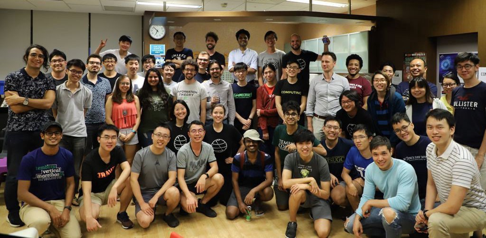
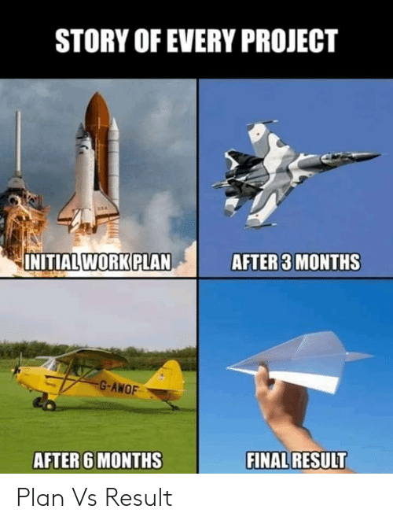

*Qiskit Hackathon @ Singapore Participants & Organizers*

Last weekend (11–12 Oct), over 40 participants had great fun hacking in Singapore with IBM Qiskit coaches from Tokyo and New York. This was the first ever community-driven Qiskit hackathon, organised by Evon Tan (CQT), Anurag Saha Roy and myself with technical support from IBM Qiskit team. The event was held at the Centre for Quantum Technologies (CQT).

If you want to read about the nitty-gritty of the hackathon, check [this article](https://medium.com/qiskit/roundup-of-qiskit-hackathon-singapore-de651921f2cd) written by Anurag. Also, look out for the [coverage of the hackathon](https://www.quantumlah.org/about/highlight/2019-10-hackathon-quantum-coding) at CQT's website.

I will start this post by sharing my personal journey, that took me, in a matter of months, from being a participant of the first Qiskit Camp to becoming an organiser of the first community-organised Qiskit Hackathon.

## Qiskit Camp: birth of QPong

I first came to know about Qiskit and Qiskit Camp from Hanhee Paik (IBM Research) when she came to CQT's [annual symposium](https://cqt11.quantumlah.org/) in Jan 2019. Hanhee helped me get the invitation to the Qiskit Camp held in Vermont, US soon afterwards.

Before the Qiskit Camp last March, I had no experience in software or game development. During the Camp, I formed a team with Jarrod Reilly and Anastasia Jeffery (both from University of Colorado Boulder). Together we made a quantum version of the classic video game Pong, called [QPong](https://github.com/HuangJunye/QPong), with mentorship by one of the Qiskit coaches, [James Weaver](https://twitter.com/JavaFXpert).

Since then, QPong has been [demoed in a museum](https://twitter.com/JavaFXpert/status/1114626404778426370), ported to the [IBM Quantum Arcade machine](https://twitter.com/HuangJunye/status/1172196396721532928) and [featured on YouTube](https://www.youtube.com/watch?v=a1NZC5rqQD8&list=PLOFEBzvs-Vvp2xg9-POLJhQwtVktlYGbY). It even got me [an invitation to CERN](https://indico.cern.ch/event/838035/). Now, some call me the "QPong guy"!



## The power of Twitter: the beginnings of the Hackathon

After the Camp, I kept thinking about bringing that amazing experience to students in Singapore who might not have had the chance to attend any Qiskit Camp.

Around May, I contacted Suzie Kirschner, the Qiskit Global Event Lead, to discuss a potential Qiskit
Hackathon. But the planning really kicked off after I saw a tweet by Anurag, then a Research
Assistant at the CQT, making a petition to host a Qiskit Hackathon in Singapore.



We then teamed up and quickly got the support from both CQT and Qiskit. With the expert guidance of Evon Tan from CQT, Yuri Kobayashi and Brian Ingmanson from Qiskit, the planning moved on quickly. And the rest is history (that you can read [here](https://medium.com/qiskit/roundup-of-qiskit-hackathon-singapore-de651921f2cd) and [here](https://www.quantumlah.org/about/highlight/2019-10-hackathon-quantum-coding)!).

## Qiskit Hackathon @ Singapore: lessons learnt

### The good

If participating in a hackathon is exhausting, organising one is on another level. Neither Anurag nor I had done it before. We had a lot to learn.

Fortunately, we had generous financial and logistical support from CQT. Special mention goes to Evon (CQT), for handling most tasks, including budgeting and logistics. The marketing strategy also worked unexpectedly well, as all the spots were filled up in less than 24 hours after the event page went live. Even though we didn't target specific participant demographics, we eventually had a healthy mix of undergraduates and graduates with diverse backgrounds as well as working professionals from research institutes.

Making sure there were enough learning resources (e.g. links to Qiskit videos and tutorials via email) for participants available before the Hackathon was crucial for its success. And in a situation like ours, dedicating the first morning to workshops was a wise decision, as most participants were new to quantum computing. Prof Dimitris Angelakis (CQT) gave a crash course into quantum computing at the start, followed by talks on the basics of Qiskit by Luciano Bello (Qiskit) and its many applications by Rudy Raymond (Qiskit). As for myself, I kicked off my speaking career (!) by giving a talk about making games with Qiskit, based on my experience of making QPong and the QPong Arcade.

*Do you recognise who's on my T-shirt? Yes, he is the [President of Nintendo of America](https://en.wikipedia.org/wiki/Doug_Bowser)!*

### The bad

Even though the Hackathon exceeded our expectations, there were a few things that could be improved in future hackathons.

Workshops should be more hands-on. The workshops jammed too much information and did not provide opportunities for hands-on activities. If I were to do it again, I would choose to arrange 2 sessions of hands-on workshops: one on Qiskit basics and one on its applications (of course, I would go for Qiskit games!).

Ideas pitching and team formation. The methods we chose for ideation and team formation were not effective. We used [Github issues](https://github.com/qiskit-community/qiskit-hackathon-singapore-19/issues) as a way for coaches and participants to put forward their ideas. It was very difficult to keep tracks of the team members on Github. Some teams had too many members while others did not have enough members. We should use crowdforge.io or hackathon.io for future hackathons.

Cultural differences. During the pitching session, organisers had to make a lot of efforts to encourage participants to pitch their ideas. The situation was very different from previous Qiskit Camps where so many people wanted to pitch their ideas that the organisers had to limit the time for the pitching sessions.

I think there are two main factors. First, as mentioned before, most participants in the Hackathon were not familiar with quantum computing before the event, whereas many participants for Qiskit Camps were students and researchers in closely-related fields. Another important factor is the cultural difference between Asian and European/American. In Asia, students tend to be shy and hesitant to express their thoughts if they are not certain about the subject.

Nonetheless, when participants felt confident in smaller teams, they were willing to brainstorm together and to come up with their own projects. All in all, 4 projects out of 10 came from participants, which was reassuring!

### The ugly

Nothing in quantum computing is ugly, since [IBM Q System One](https://en.wikipedia.org/wiki/IBM_Q_System_One) is so beautiful ;)

*Isn't it gorgeous?*

## My experience as a first-time coach

Apart from organising, I also had the chance to coach a few teams that were working on games (4 out of 10 teams!). Although I wasn't hacking alongside them, I could go to discuss with each team regularly. This was not only to check their progress and provide feedback, but also to have some fun playing their games!



I found this process to be empowering. Even with my own limited experience of Qiskit and game development, I could help the teams to focus on the essence of their projects provide ideas for improvement. My role also entailed debugging their codes and making suggestions for their final presentation.

I emphasised the teams to manage their expectations, which is, in my opinion, one of the most important skill for project management. One participant reminded everyone after hours of hacking with this photo:

*[So true!](https://me.me/i/story-of-every-project-after-3-months-initial-work-plan-8321639662484cf399ca13c20567379e)*

Still, I was thrilled to see that most teams came up with something better than paper planes!

## What's next?

I am glad that some participants of the Qiskit Hackathon @ Singapore were invited to the upcoming [Qiskit Camp Asia](https://qiskit.org/events/asia/) (which will be held in Japan on Nov 18–21). I will also continue working with the teams that made a quantum game, to help them improve the projects for submission to [IBM Q Award](https://ibmqawards.com/). It is crazy to think that if they got a prize, they would be invited to the Qiskit Camp next year. If that came true, I would have not only accomplished my initial goal of bringing the Qiskit Camp experience to Singapore, but also contributed to sending some students to experience the original Qiskit Camp.
