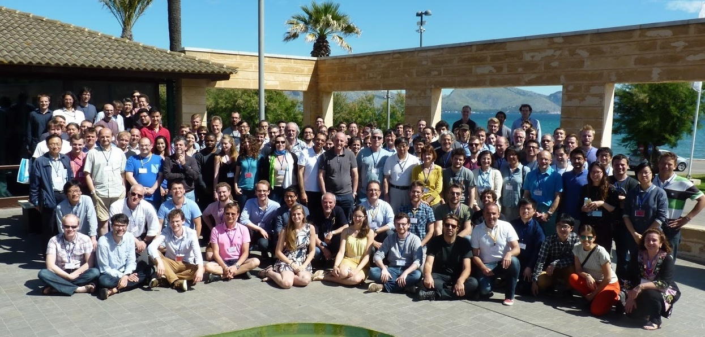
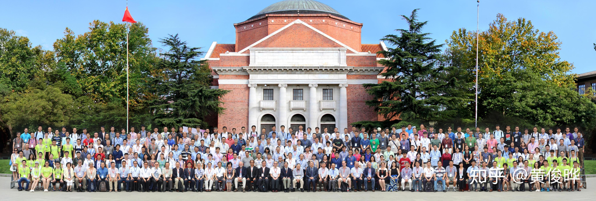
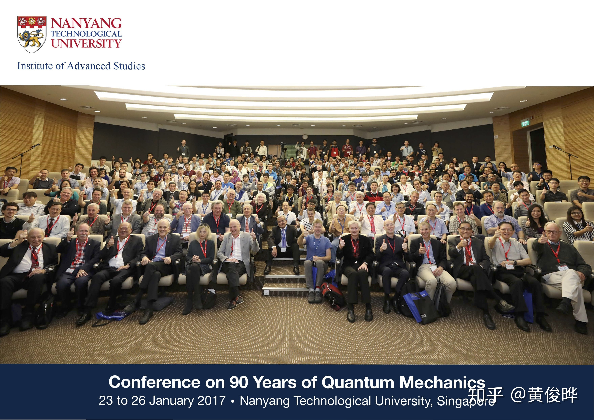
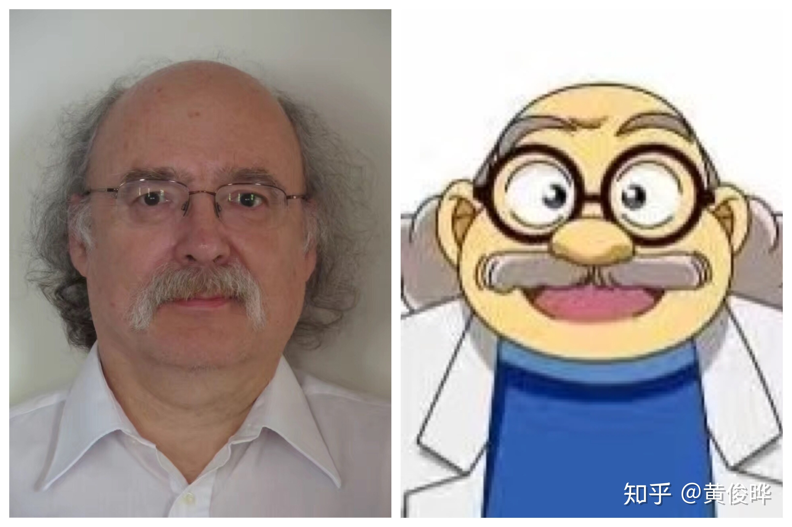
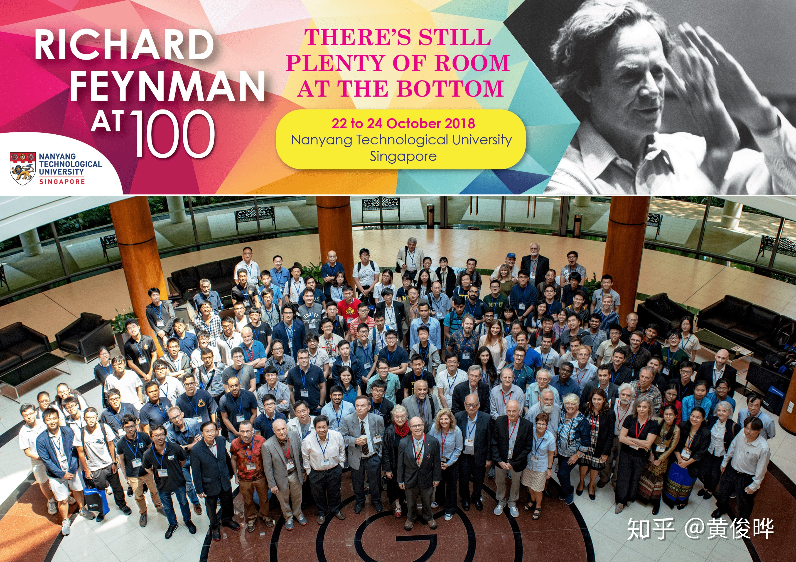

很久没在知乎上写东西了。不只是在这个专栏，这两三年甚至连答案都没写过几个。这个专栏有上百个人关注，却一直都没有更新，承蒙大家错爱。上一篇讲的还是我刚拿到博士录取通知的事，现在我都快要博士中期考核了。

正是因为在写中期考核报告，我回顾了一下博士前两年的经历，学到的东西，感觉差强人意，还过得去。虽然还没发表任何论文，但是学到了不少知识。我想在这个专栏里也写个类似于中期考核报告的文章。在这里挖些坑，写下我要写的文章，这样我就不会一直拖着。

## 参加会议的经历

### Majonext2017

*Majonext2017大合照*

尽管还没有论文，我仍然很幸运地在新加坡之外参加了两次学术会议。第一个是17年5月在西班牙马略卡岛举行的Majonext2017会议，另一个是下面会提到的OCPA9。[Majonext2017会议](http://majonext2017.ifisc.uib-csic.es/)大概是第一个以马约拉纳费米子为主题的诡异。会上大牛云集，Kouwenhoven、Marcus、Molenkamp、Jarillo-Herrero、张首晟都在。在会上也认识了不少学生辈的大牛，特别是邓明堂和李川。这两个人现在都当上教授了。这是我第一次正式参加的学术会议，而且学到了很多东西，虽然过了那么久当时受到的震撼和感想都忘得差不多了，但是我一定要认真写下来。

### OCPA9

*OCPA9大合照*

如果你有关注这个专栏的话，你大概知道[我的物理征程](https://zhuanlan.zhihu.com/p/19788446)起源于在新加坡举行的[OCPA8](https://livestream.com/NTU/ocpa8)（第八届全球华人物理学家大会）。三年以后（17年7月）[OCPA9](http://ocpaweb.org/home/ocpa9-conference/)在清华举办，虽然我参加完Majonext，但是导师还是非常接近人情地让我去北京参加对我意义重大的OCPA9。（当然，那是因为我帮他申请到了三百万新币的科研经费。）会议组织方面，OCPA9比OCPA8要差太多了。小报告在普通教室里进行，有些报告听的人多，课室里连站的地方都没有。吃饭要走大老远到饭堂吃，吃完又得赶紧往回走，很多老教授走不过来要错过下午第一场报告。不过OCPA会上报告的广度和深度是很多会议都比不上的。虽然我做的是凝聚态，但是我听得最多的是高能。能够从项目主持人口里听到关于环形正负电子对撞机、天琴计划、锦屏暗物质探测实验室的进展，是非常难得的经历。关于OCPA9的文章其实我已经写了两千字了，但是最后没有发表出来。回头修改一下就发表。

### QM90、Workshop on Topological Phase Transitions and New Developments和Feynman100

南洋理工大学有个[高等研究院（IAS）](https://www.ntu.edu.sg/ias/Pages/default.aspx)，不怎么做研究，但是常常组织非常高规格的学术会议。这些会议大多是纪念性质的，所以报告的内容不会太枯燥难懂，一般我去都是为了听大牛讲故事。本科的时候我就去过不少。我的Google Drive里有张记录我见过的诺奖得主名单。这几年来参加IAS的各种会议，见过的诺奖得主居然接近50个！！！我的目标是Gotta Catch 'Em All。O(∩_∩)O~

*QM90大合照*

2017年是量子力学奠基90周年，IAS搞了一个[纪念量子力学的会议](https://www.ntu.edu.sg/IAS/Events/2017/QM90/Pages/default.aspx)。单诺奖得主就有六个：David Gross、Anthony Leggett、Gerard ’t Hooft、Arieh Warshel、​Rudy Marcus、杨振宁。像张首晟、薛其坤、叶军、大野英男、Stuart Parkin、Peter Zoller这级别的大牛都只能算是小字辈。

*Duncan Haldane，邓肯·好蛋，江湖人称‘’阿笠博士‘’*

2016年，拓扑物理拿了诺贝尔奖。没过几个月，IAS就把Haldane和Kosterlitz请来，搞了一个[会议](https://www.ntu.edu.sg/IAS/Events/2017/TPT17/Pages/default.aspx)。人称“阿笠博士”的Haldane还把诺奖金牌拿出来任人摸玩，可惜我没摸到T_T。

*费曼100周年纪念会大合照*

今年是费曼诞辰100周年，IAS在10月底搞了一个[纪念费曼的会议](https://www.ntu.edu.sg/IAS/Events/2018/RF100/Pages/default.aspx)。据会议的组织者私下跟我透露的信息，本来Caltech都没打算纪念费曼，但是IAS执意要搞，所以Caltech也得自己搞一个。一个跟费曼无亲无故的太平洋小岛国要搞隆重的纪念活动，而费曼长期工作的Caltech总不能无动于衷吧？那得多丢人现眼啊？但是规格还是差太远了。Caltech的纪念会议只搞了一晚加一天，IAS的纪念会议搞了整整三天，还在新加坡的艺术科学博物馆搞一个半年的费曼展。这个会议安排的很有意思，一天只有4个人讲，讲60分钟，讨论45分钟。本来我特别担心讨论那么长时间会冷场，没想到那么长的讨论时间都不够用，大家都踊跃发言，互动感特别地强。虽然作报告的只有20个人，但是台下还有很多不做报告的大牛。财大气粗的IAS从美国大老远的把费曼的家人、同事、朋友都请了过来！在讨论的时间里，这些熟悉费曼的人讲了很多关于费曼的故事。这次会议对我的影响也是非常深远。我应该趁热打铁把文章写出来，记录一下。

这些会议规格都很高但是规模都很小，一般只有一两百人参加，所以这些诺奖得主、大牛不只可以远观，还可以“亵玩“。有什么问题可以随便发问，吃饭、吃茶点的时候还可以去找他们搭话。QM90的时候我跟‘t Hooft讨论了一些真空和黑洞的问题。Feynman100的时候我问了Wilczek好多关于拓扑超导的问题和他对量子计算的看法。但是让我印象最深刻的是Peter Zoller。我问他，现在量子计算机有那么多种硬件实现方式，包括超导、离子阱和最新的拓扑超导，到底哪一种才是“晶体管“？他说，“我以为做量子计算就像登山。尽管你登的这座山未必是最高的珠穆朗玛峰，无论是乞力马扎罗山还是阿尔卑斯山，在登山过程中也都能看到独特的风景。登山的乐趣不在于登顶，而在于欣赏途中的风景。做量子计算也一样，让我们多爬几座山，欣赏不一样的风景。

## 理论知识

读博士两年了，物理基础知识仍然不是很扎实。在实验室里，基础物理知识最差的是我，研究课题最难的却也是我。我理解得不算很深入，但是我希望能把学到的知识写在这个专栏里。至少可以梳理一下知识，也希望知乎的大牛指点一下。

我想写的理论知识有：二维超导、拓扑超导、拓扑量子计算、非局域自旋阀、自旋输运、自旋弛豫。

## 实验仪器知识

做实验物理还学到很多在论文里比较少提到的实验仪器工作原理和使用技巧。上面提到的理论知识只要能看懂英文，就能找到很多相关文献。但是关于实验仪器的文献就比较少了，所以写下来大概更有价值，也更符合我这个专栏的名字。

我想写的实验仪器知识有：脉管循环制冷机工作原理、稀释制冷机工作原理、低温过滤器种类和工作原理、测量仪器远程控制和软件、锁相放大器、范德华异质结转移技术。

## 实验数据分析

做实验除了做样品和测量，更重要的是数据分析。如果数据不是很庞大，分析不是很复杂，一般来说Origin是够用了。Origin也可以编程，不过LabTalk编程语言非常不友好，指令和函数的名字更像汇编。Origin还可以用一个类似C语言的Origin-C编程。但是尝试过LabTalk以后我决定放弃用Origin做数据分析。但是还在测量的时候一边测一边快速画图还是没有什么软件能比得上Origin。后期数据分析我用Matlab和Jupyter Notebook。这一部分我想写一篇文章详细讲一讲。虽然我懂的不多，免不了献丑，但是希望能够抛砖引玉，得到大牛的指点。

我还想写一些具体的例子。我发现一些非常浅显的数据分析，在没有前人指导的情况下，很难自学。真是因为都太简单了，论文里一般都是一笔带过，而我看完以后都是一脸懵逼，完全不知道如何下手。比如说：[Aslamazov-Larkin formula](https://www.sciencedirect.com/science/article/abs/pii/0375960168906233)长什么样子？很多文章都说超导转变温度可以用这个公式来拟合，然后引用原文。而原文是50年前写出来的，讨论了两个形式，而且我也不清楚50年过去这个公式是不是有个更好的形式，或者更精准的常数等等。这么简单的一个公式我也花了好几天才搞清楚。类似的情况有

- 如何从Hc-T数据中算出金兹堡-朗道相干长度
- 如何用[Halperin-Nelson公式](https://journals.aps.org/prl/abstract/10.1103/PhysRevLett.41.121)拟合得到BKT相变温度
- 为什么BKT相变温度可以在VI测量里得到？为什么BKT相变发生在 [公式] ?
- 如何用三维金兹堡-朗道模型和二维Tinkham模型拟合Hc2的各向异性
- 如何用[BTK模型](https://journals.aps.org/prb/abstract/10.1103/PhysRevB.25.4515)拟合隧道谱

坑挖了那么多，感觉一年也写不完。暂且把目标定为博士毕业前写完吧！
