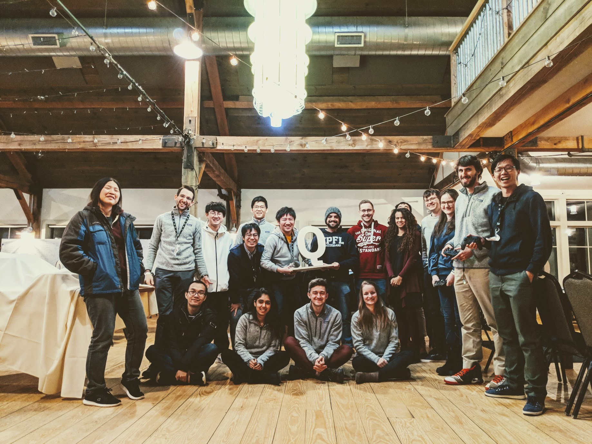
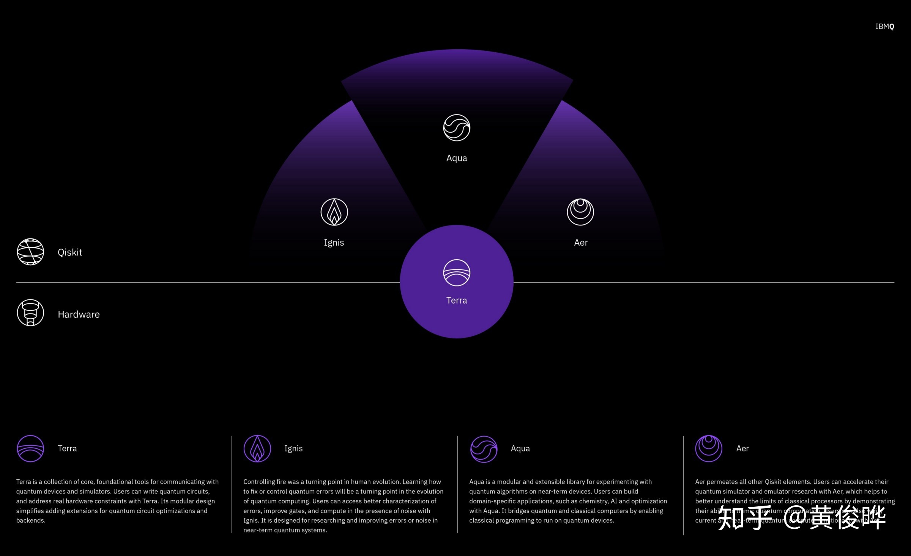
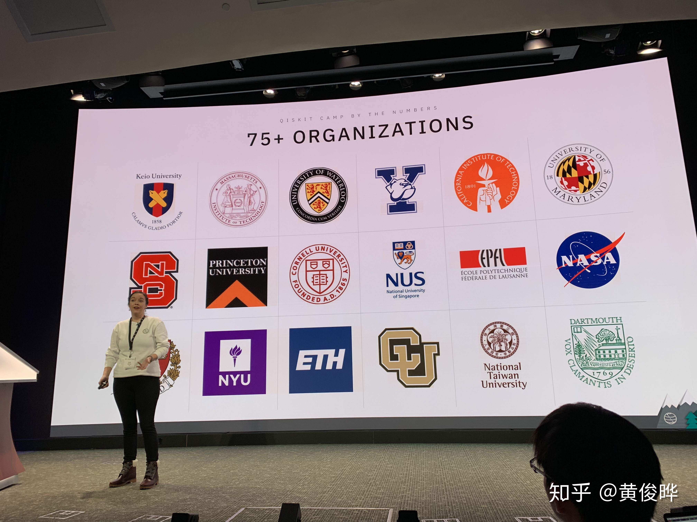
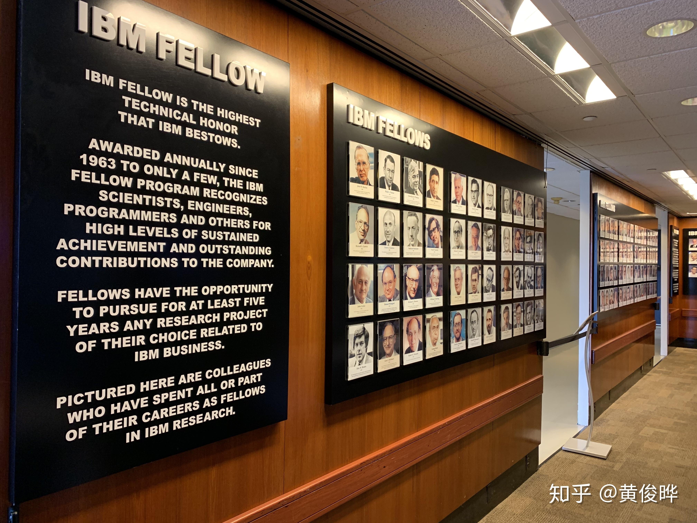
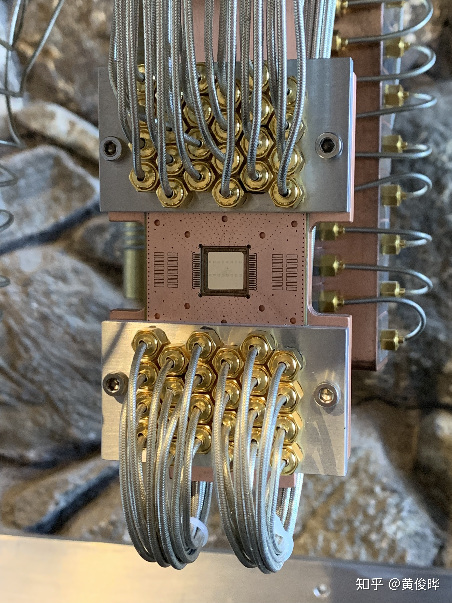
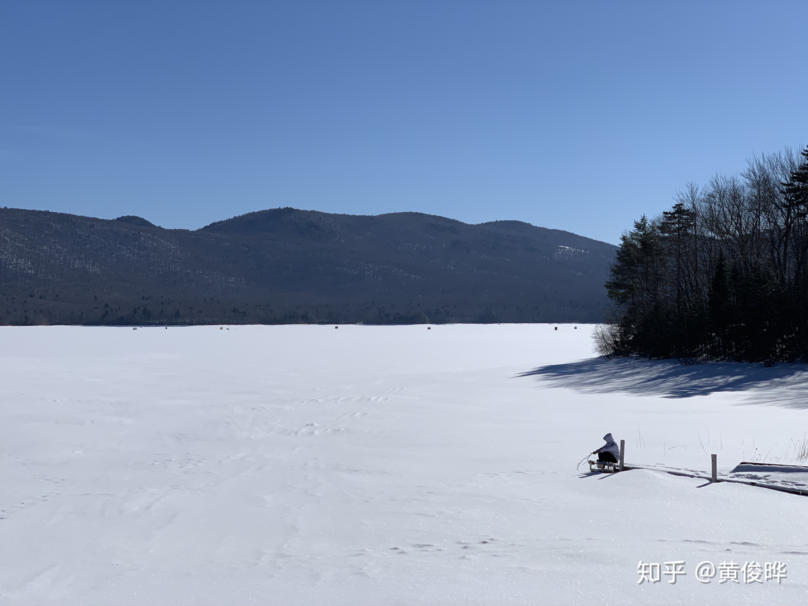
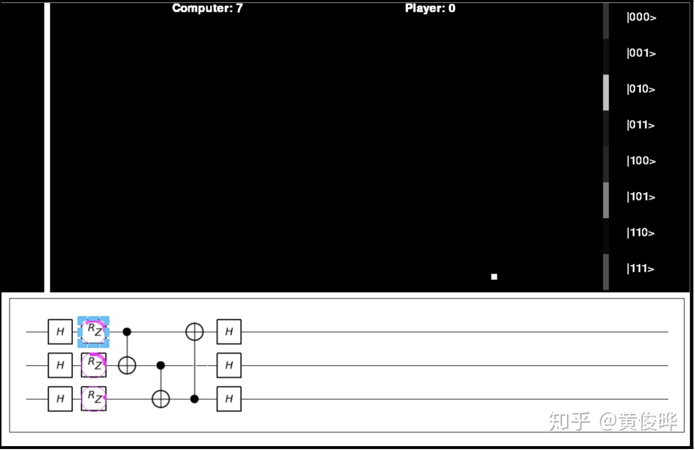

*Qiskit Camp 4am Club*

在一个偶然的机会下，我受邀请参加IBM组织的第一届[Qiskit Camp](https://medium.com/qiskit/recap-of-qiskit-camp-2019-4d95f07dd179)。这活动正好安排在March Meeting之前，所以我开会顺便就去参加了。

*Qiskit的架构*

[Qiskit](https://qiskit.org/)是IBM开发的基于Python的开源量子编程库。这个库包含好几个子库，名字都是拉丁语的元素，很有意思。Terra是土元素，有奠基的意思。Terra是Qiskit的基础，最基本的东西都在里头。Aer是气元素，用来模拟量子计算机。Aqua是水元素，包含很多量子算法，特别是量子化学。Ignis是火元素，用来模拟噪声和错误。官方介绍[请点这](https://medium.com/qiskit/qiskit-and-its-fundamental-elements-bcd7ead80492)。最近[新开了一个专栏](https://zhuanlan.zhihu.com/quriosity)，打算专门写量子计算相关的文章。应该会写一两篇Qiskit的教程，虽然我也只懂些皮毛。

*我大NUS的Logo竟然被放到最中间！*

这次活动一共有135人参加，来自19个国家，48个大学，9个研究所，5家量子初创公司。我拉着实验室同学一起去。这样一来，NUS就有六个人参加，估计是所有大学里人数最多的。（所以NUS的Logo放在最中间^_^）Qiskit Camp的第一天在纽约州Yorktown的IBM J. T. Watson Research Center举行。这天的主要目的是教会所有人怎么用Qiskit。参会的大部分人都没怎么用过Qiskit，而用过Qiskit的小部分人参加自发组织的Unconference，当场提出一些课题进行讨论。IBM官方活动总结[请点这](https://medium.com/qiskit/recap-of-qiskit-camp-2019-4d95f07dd179)。

*IBM Fellow名人堂*

*唯一可以拍照的稀释制冷机*

*稀释制冷机不只是个摆设，下面似乎还装着芯片。可惜手机不给力，看不清芯片里是不是量子比特。*

第一天的Workshop结束以后的当天晚上，IBM把我们载到300公里以外的佛蒙特州的深山雪林里的小黑屋（误）里，把所有人分成3到5人的小组，进行24小时的Hackathon。我和两个科罗拉多大学的本科生组队，在一个IBM资深程序员的带领下，搞了一个量子版的“经典”游戏《乓》：QPong。

*佛蒙特州是滑雪胜地，到处都是雪。*

*QPong游戏界面*

QPong通过量子电路来控制挡板位置来把小球反弹回去。目前的版本有三个量子比特，有八种本征态，对应着挡板的八个位置。小球未到达挡板之前，挡板可能出现位置的概率用透明度表示。当小球到达挡板区域，量子电路实现的量子态被测量，得出的结果决定挡板最终位置。量子电路可以实现的量子门有X，Y，Z，Rx，Ry，Rz，Hadamard和CNOT。游戏是用Qiskit和Pygame实现的，源代码放在[Github](https://github.com/HuangJunye/QPong)。运行之前需要安装Qiskit、Pygame和Matplotlib。推荐安装PyCharm来运行。如果你们感兴趣，可以一起开发这个游戏。目前游戏还是非常简陋。电脑玩家完全随机，非常地笨。未来还打算添加双人游戏、量子比特数量升级等等。也可以修改成量子打砖块，趣味性就更强了。
