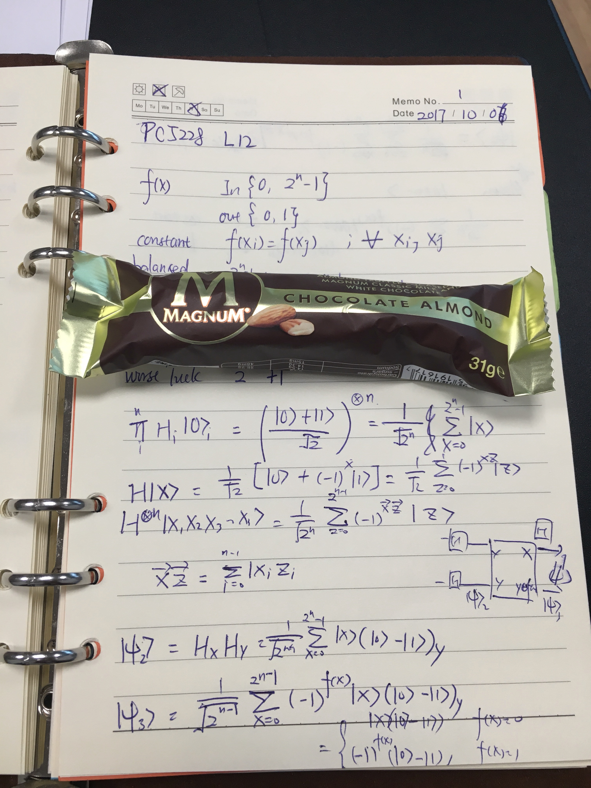

这个学期选了一门量子信息课，算是弥补了我不能到隔壁CQT读量子信息博士的遗憾。这门课的老师蛮有意思的。虽然他的英语口音很重，讲话还经常停顿，但是他的课听起来还是蛮有趣的。他好像很喜欢吃巧克力。至少，我可以确定的是，他很喜欢用巧克力来奖励学生。讲习题的时候，如果你在白板上写下正确答案，他就会奖你一根巧克力。我的物理和线性代数基础不好，所以我还没有在习题课上写过答案。但是，上周他奖了我一根巧克力。那不是因为我写下了正确答案，而是因为我猜中了引力波会拿到今年的诺贝尔奖。把巧克力递给我的时候，他说，“这是属于你的诺贝尔奖。”

这是我这辈子选的第一门物理系课程，也很可能是最后一门。我很喜欢物理课，因为每个结论都是一步一步有根有据地推导出来的，而不是因为某某伟人说这个是对的，所以我们就得相信这个就是对的。材料工程本科的四年，让我的脑袋变得十分懒惰。老师从来不鼓励学生去思考。大部分课程都很简单，只要死记硬背就能考到好成绩。即使是半导体物理课和热力学课，本应有很多公式推导，也因为学生的抱怨而简化，直接给出结论。很多应该覆盖的内容因为学生水平太低教不了，也就跳过去了。一方面我对这样的教学风格感到不屑，另一方面我自己也没有能力去自学。久而久之，我把数学和物理都丢了，成绩也不见得很好。更糟糕的是，我养成了死记硬背而不是努力思考的学习习惯。我忘记了“知道一个概念的名字并不等于就搞懂了这个概念”。很多东西我都听说过，但是没有几样东西我真的搞懂。前两周准备期中考试，累了的时候看了一部费恩曼的纪录片。[其中有一段](https://youtu.be/lFIYKmos3-s)他提到关于“names don't constitute knowledge”：

> One Sunday all the kids were walking in little parties with their fathers in the woods. The next Monday we were playing in a field, and a kid said to me “ What’s that bird? Do you know the name of that bird?” I said “I haven’t the slightest idea!” He said, “Well, it is a brown-throated thrush.” He said, “Your father didn’t teach you anything!” But my Father already taught me about the names of birds. Once we walked and he said, “That is a brown-throated thrush. In German it is called Pgleegel flügel. In Chinese it is called Keewontong. In Japanese a tohatohara, and so on. And when you know all the names of that bird in every language, you know nothing, but absolutely nothing about the bird.” And then we will go ok and talk about the pecking and the feathers. So I had learned already that names don’t constitute knowledge.

后来我又看了几篇关于Elon Musk的第一性原理思考（first principle reasoning）的文章。我才猛然意识到他们俩说的是一样的东西。而我本科以来都只是“knowing the name”，只是“learning by analogy”。我跟费恩曼、马斯克们最大的差距，就在于这种独立思考的能力。我意识到如果我不能掌握这种独立思考的能力，我就不可能成为一个伟大的科学家。而学物理就是培训这种能力的最佳方法。之后我会写一篇文章专门讲第一性原理和独立思考。

量子信息这门课对我来说还是蛮有挑战性的。我没有系统地学过量子力学，基本上没学过线性代数。所以，我在这门课上特别多下了一些功夫。两周前的期中考试，我只拿了58分，而班上中位数是85分。我的分数应该是班上倒数。不过我还是挺满足的，起码我不是倒数第一。班上大部分同学都是物理系的，而我几乎没有任何物理背景。

这周开始讲量子算法。周二的时候，老师讲了2个量子位的Deutsch algorithm。最后的结果很怪异，只要测量第一个量子位就可以知道函数是怎样的。（这个具体问题我也打算写一篇文章来讨论一下）于是，我在课后研究了一番，得出了结论：的确只要测量第一个量子位就可以，而测量第二个量子位永远都会得到一样的测量结果，所以不能用来判断函数。还有，第二个量子位的输入必须是|1>，否则测量第一个量子位也不能判断函数。

周五的时候，老师继续讲Deutsch algorithm，推广到n个量子位。班上大部分同学都听懵了，我却能听得很明白，还能提出一些问题。这种久违的优越感让人怀念。原来，以前我成绩好现在成绩差，不是因为我以前聪明现在变笨了，而是因为我以前在课外花了很多时间去专研，特别在喜欢的科目上。然而本科的课让我习惯于只是上课时听课，下课以后最多做一些老师布置的习题，然后在考试前两天复习一番。这样的学习强度自然不能把知识都得明明白白。

下周二讲大名鼎鼎的Shor algorithm，上课前我得去钻研一番。