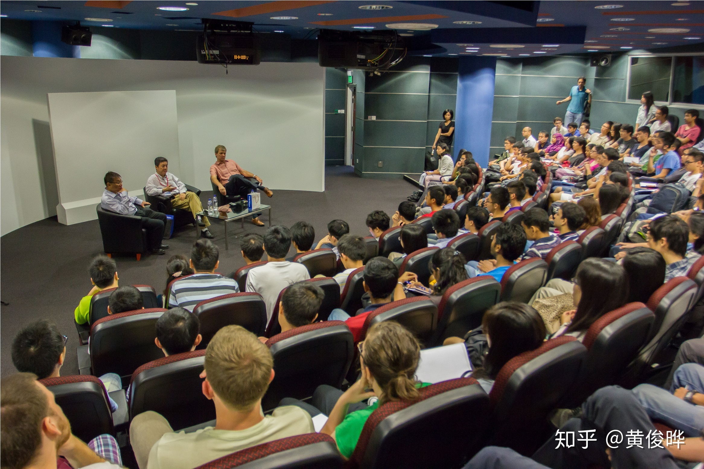
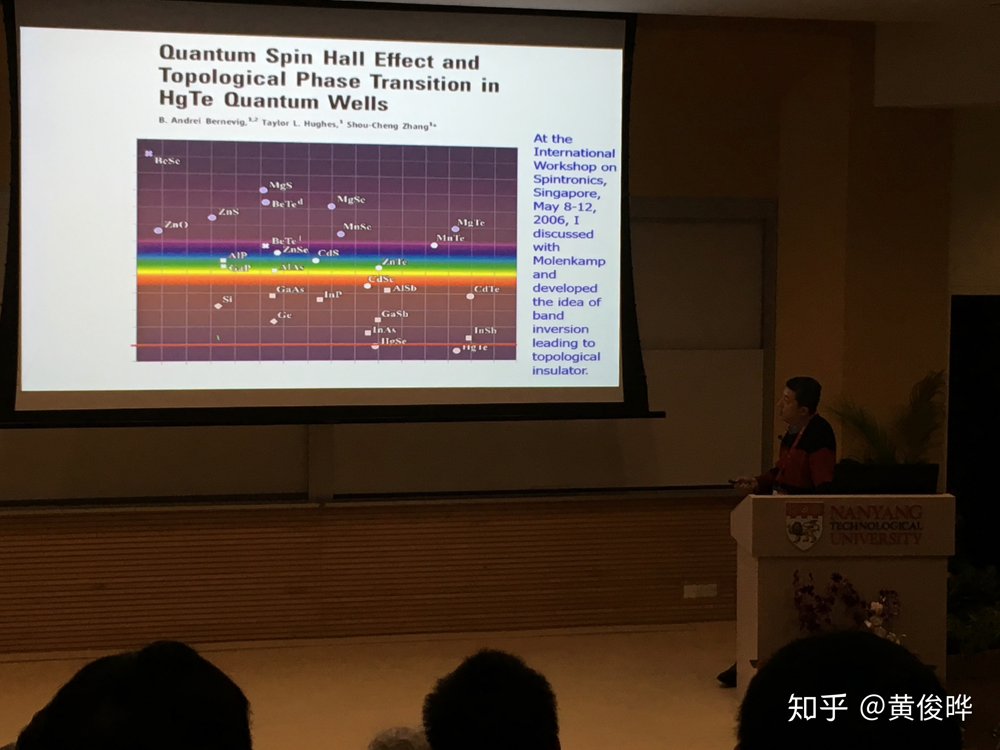
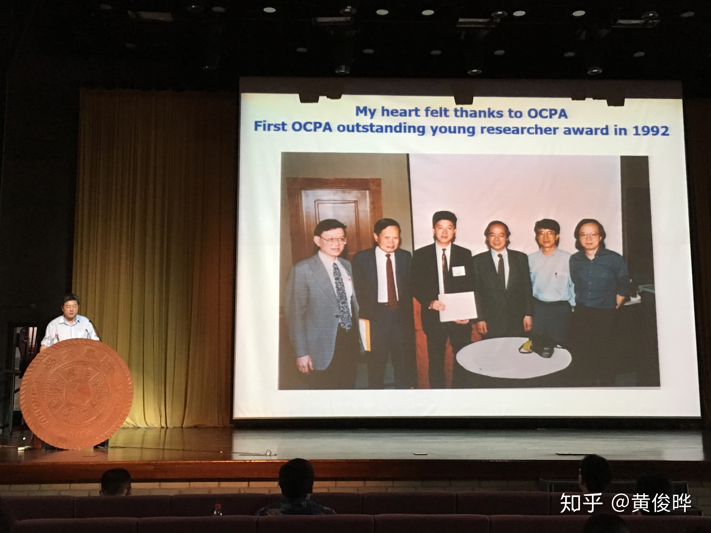
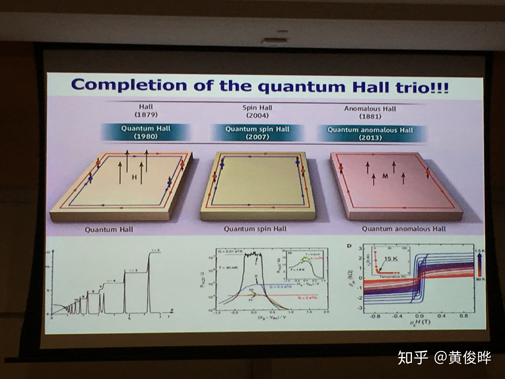

今天在微信上知道张首晟去世的噩耗，非常震惊。两天前我才在专栏里回忆了一下读博士这前两年做了些什么，学了些什么。里面提到我参加过的会议，其中有三个，张首晟都去了。我跟张首晟不熟，他不认识我，我也没跟他说过几句话。我仰慕他，为他做出的物理贡献感到骄傲，但同时我又对他后期分心搞风投感到不满。在这里我想写的是，在这三次会议里张首晟说过的一些东西，一般报道不会提到的一些小事情，以作纪念。

这三次会议，分别是新加坡的QM90、西班牙的Majonext2017和清华举办的OCPA9，都在2017年。这三次会议，张首晟的报告几乎是一样的，讲的都是17年7月发在[Science上](https://science.sciencemag.org/content/357/6348/294)的工作：在QAHI+SC结构里实现拓扑超导，并且探测到会移动的手性马约拉纳费米子。不过，在这三次报告里，可以看到这个实验的演进，后来补充的几个实验结果让论文更有说服力。不过，这个工作发表以后还是引起了很多争议，包括文小刚写了篇PRL直接打脸，详情可以看看[JCCM的评论](https://www.condmatjclub.org/?p=3219)。

## Interactive Session with Prof Zhang Shoucheng

*Interactive Session with Prof Zhang Shoucheng at NTU，在IAS网站上盗了这张图*

第一次听说张首晟，是2013年。当时我还是懵懂的材料本科生。我收到张首晟[来NTU作报告](https://graphene.nus.edu.sg/interactive-session-with-prof-zhang-shoucheng-at-ntu/)的邮件。搜了一下，看到Google Scholar引用两万多！这个人真牛逼！但是看一下他研究的东西：拓扑绝缘体？量子自旋霍尔效应？量子反常霍尔效应？这些名词完全没看懂，甚至连听都没听过，于是没有去听……后来阴差阳错地转到了物理，做的研究还跟拓扑绝缘体、拓扑超导体息息相关。看的文章越多，就越后悔当初没去听张首晟的报告。

## QM90

*张首晟在QM90会议上提到，他的QSHE工作的eureka moment，发生在11年前的这个讲堂里！*

错过13年的报告，终于见到张首晟时，已是四年后。那是NTU-IAS举办的纪念量子力学奠基90周年的QM90会议。报告的内容上面已经说过了。这里想说的是他跟NTU-IAS的关系。在会上他表达了NTU-IAS的感激，因为他这一生最重要的工作：量子自旋霍尔效应（QSHE），要归功于06年IAS组织的[Workshop on Spintronics](https://www.ntu.edu.sg/ias/PastEvents/2006/workshoponspintronics/Pages/default.aspx)。当时他看到Molenkamp展示出来的半导体带隙图（下图），发现HgTe的带隙居然是负值！在跟Molenkamp详细讨论以后，得到了CdTe-HgTe-CdTe量子阱的想法（[Bernevig-Hughes-Zhang模型](https://science.sciencemag.org/content/314/5806/1757)）来实现QSHE。接着跟Molenkamp合作，实验很顺利地做进行，一年后就[发表出来了](https://science.sciencemag.org/content/318/5851/766)。当时我听到这个故事，顿时感觉热血沸腾。没想到我的母校能跟QSHE扯上这么大的关系！瞬间自信爆棚，觉得自己也能够做出同样等级的研究（才怪）。

## Majornext2017

最让我感到遗憾的是，即使一年内三次见到张首晟，我也没有鼓起勇气在会间跟他搭话。我跟他唯一的对话，是在他的报告之后问过一个问题：怎么在QAHI+SC这个拓扑超导体结构里做量子计算。他的回答很敷衍、很标准化、很不靠谱：加个磁场打开漩涡，然后用STM来操控。今年早些时候他[在PNAS上发了一篇文章](https://www.pnas.org/content/115/43/10938.short)，讲的正是我问的问题。这篇论文很靠谱，并没有用到漩涡，跟他的回答完全不沾边。这篇文章中他的贡献有多少不可得知。可能这主要是祁晓亮带着学生做的。

听说这几年张首晟的心思都放在风投，而不是科研。这一点在Majonext2017的时候表现得特别明显。报告讲完后，Jarillo-Herrero问了张首晟好几个问题。那是些什么问题我已记不清，只记得是蛮technical的问题。正常情况下，如果问题回答不上，一般人会说“This is a good questions”或者直说“I can't give you an answer”。可是，张首晟回避不答，硬是扯到其他不相关的东西。可见他心虚，心思的确不在科研。

## OCPA9

跟张首晟最后一次见面，是17年7月在清华举办的OCPA9会议。OCPA是由北美华人物理学家发起的全球华人物理学会，每两三年开一次。对于张首晟来说，OCPA有特殊的意义。1992年，成立不久的OCPA决定要办一个奖颁给优秀年轻华人物理学家，而第一个得奖的正是张首晟。当时的张首晟，只有29岁，

这个奖在物理学界的知名度似乎不是很高，但其实含金量很高。只要看看颁奖委员会成员和获奖名单就知道：

- 颁奖委员会成员名单：杨振宁、李政道、崔琦、朱经武、沈元壤、李雅达（Partrick Lee）、沈呂九等等

- 获奖名单：张首晟、沈志勋、文小刚、杜瑞瑞、叶乃裳、许岑珂、祁晓亮、陈宇林、傅亮、麦建辉（Kin-Fai Mak）等等

在OCPA9上，张首晟分享当年获奖的照片，并以此鼓励年轻人努力做科研。

*OCPA9会上，他分享当年拿到的OCPA OYRA奖时的照片，鼓励年轻人努力做科研。（言下之意：如果你能拿到这个奖，就说明你跟我一样牛逼^_^）*

## 结语

网上流传着这么一个故事：张首晟在柏林自由大学本科毕业以后，对未来感到非常迷茫。去哥廷根造访的时候，他到了一片墓地，那里躺着高斯、希尔伯特、海森堡、波恩等著名数学家和物理学家。每个人的墓碑上没有墓志铭，只有一道公式。这几个墓碑让年轻的张首晟感到非常震撼。人活一辈子到底为了什么？要为这个世界做出什么贡献？留下什么东西？或许一道公式就够了。张首晟走了，可能没有留下一道公式，但他完成了一个拼图：

*Quantum Hall Trio*
